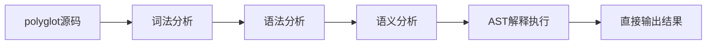

# polyglot/文达编程语言 使用说明


革命性编程语言，支持符号化语法和中文编程，具备智能内存管理和零垃圾回收器设计。**首个支持Windows系统级文件关联的中文编程语言！**

## 🌟 核心特性

### 🌍 双语言模式
- **polyglot**（英文版）：使用半角符号的现代编程语言
- **文达**（中文版）：全角符号与中文标识符的本土化编程体验

### 🔧 核心功能
- **符号化语法**：直观符号替代传统关键字
- **智能内存管理**：编译期循环引用检测 + 智能指针
- **三符号赋值系统**：`=`强引用、`~=`弱引用、`:=`值拷贝
- **外部可配置符号**：JSON配置实现动态符号映射
- **零垃圾回收**：高性能内存管理，无运行时开销

## 🚀 快速开始

### 环境要求

**用户使用环境（零依赖）：**
- 支持UTF-8编码的终端
- Windows/Linux/macOS操作系统
- 无需安装任何编译器！

**开发者编译环境（仅开发polyglot编译器本身时需要）：**
- C++17 兼容的编译器 (g++, clang++, MSVC)
- CMake 3.10+
- JSON配置文件支持

### 🖱️ Windows一键安装（推荐）
```bash
# 下载项目后，右键以管理员身份运行
一键安装文达编译器.bat
```
**安装后直接双击`.文达`或`.pg`文件即可编译！**

### 🔧 手动编译安装
```bash
# 克隆项目
git clone https://github.com/Fandel-Chuang/polyglot.git
cd polyglot

# Windows：使用中文构建脚本
构建达文编译器.cmd

# Linux/macOS：使用构建脚本
./build.sh

# 测试安装
文达.bat ai_tests/测试/中文语法测试.文达
```

### 📋 使用方法

#### Windows图形界面（文件关联安装后）
```bash
# 双击编译 - 像使用Office一样简单
双击 ai_tests/测试/中文语法测试.文达

# 右键编译 - 文件管理器上下文菜单
右键文件 -> "用文达编译器编译"
```

#### 命令行使用
```bash
# 中文命令（推荐）
文达.bat 你的程序.文达
文达.bat 你的程序.pg

# 英文命令
./compiler/polyglot.exe 你的程序.pg
```

## 📚 语法指南

### 基础语法对比

| 功能 | 英文版 (polyglot) | 中文版 (文达) |
|------|-------------------|---------------|
| 模块导入 | `>> "iostream"` | `》》 "输入输出流"` |
| 变量声明 | `name := "Alice"` | `姓名 ：= "爱丽丝"` |
| 结构体定义 | `@ Player { ... }` | `@ 玩家 { ... }` |
| 方法实现 | `& Player { ... }` | `& 玩家 { ... }` |
| 函数返回 | `<- value` | `《- 值` |
| 循环语句 | `^(condition) { ... }` | `……（条件）｛ ... ｝` |

### 完整示例

#### 英文版Hello World
```rust
>> "iostream"

main() {
    print("Hello, polyglot!")
    <- 0
}
```

#### 中文版Hello World
```rust
》》 "输入输出流"

main() {
    print("你好，文达！")
    <- 0
}
```

### 游戏开发示例

#### 玩家类定义（中文版）
```rust
》》 "图形库"

＠ 玩家 ｛
    姓名： 字符串，
    生命值： 浮点数，
    位置： 三维向量
｝

＆ 玩家 ｛
    玩家（姓名： 字符串， 初始生命值： 浮点数） ｛
        ＿．姓名 ＝ 姓名
        ＿．生命值 ＝ 初始生命值
        ＿．位置 ＝ 三维向量｛横： 0.0， 纵： 0.0， 高： 0.0｝
    ｝

    受到伤害（伤害量： 浮点数） ｛
        ＿．生命值 －＝ 伤害量
        （＿．生命值 ＜＝ 0.0）？ ｛
            打印（＿．姓名 ＋ " 已死亡！"）
        ｝
    ｝
｝
```

## 🖥️ Windows系统集成

### 文件关联安装

polyglot/文达是**首个支持Windows系统级文件关联的中文编程语言**，提供完整的图形界面集成体验。

#### 🚀 一键安装（推荐）
```bash
# 右键以管理员身份运行
一键安装文达编译器.bat
```

#### 🔧 分步安装
```bash
# 1. 生成动态注册表文件
生成文达文件关联.bat

# 2. 安装文件关联（需要管理员权限）
安装文达文件关联.bat

# 3. 卸载文件关联
卸载文达文件关联.bat
```

#### ✨ 安装后功能

**文件管理器集成**：
- `.文达`文件显示为"文达源代码文件"
- `.pg`文件显示为"Polyglot源代码文件"
- 双击文件直接编译并显示结果

**右键菜单**：
- **用文达编译器编译** - 直接编译选中文件
- **编辑** - 使用记事本打开文件

**技术特性**：
- 🎯 **动态路径生成** - 支持任意位置安装
- 🔄 **智能权限管理** - 自动检测管理员权限
- 🇨🇳 **完全中文化** - 所有菜单和提示均为中文
- 🚀 **零配置** - 安装后即可使用

## ⚙️🔧 编译器架构

### AST解释执行流程（v1.0.0 新特性）

polyglot/文达编译器已升级为**纯AST解释执行**架构，完全独立运行，无需任何外部编译器依赖：



**全新架构特性：**
- ✅ **零依赖运行** - 无需安装g++、clang++等外部编译器
- ✅ **即时执行** - 源码直接解释执行，无中间文件
- ✅ **自包含架构** - 单个二进制文件完成所有功能
- ✅ **跨平台支持** - Windows/Linux/macOS统一体验

### 详细执行阶段

1. **词法分析** - 支持Unicode和全角符号解析，识别polyglot/文达语法
2. **语法分析** - 生成抽象语法树 (AST)，支持双语言模式
3. **语义分析** - 类型检查、变量声明验证、循环引用检测
4. **AST解释执行** - 直接遍历AST节点并执行，内置函数库支持
5. **结果输出** - 实时显示程序运行结果

### 传统编译流程（已弃用）
1. **词法分析** - 支持Unicode和全角符号解析
2. **语法分析** - 生成抽象语法树 (AST)
3. **语义分析** - 类型检查和循环引用检测
4. **代码生成** - 输出优化的C++代码
5. **本地编译** - 生成高性能可执行文件

### 架构对比

| 特性 | 传统编译器模式 | AST解释器模式（当前） |
|------|------------|-------------------|
| 外部依赖 | ❌ 需要g++/clang++ | ✅ 完全独立 |
| 执行速度 | 🚀 编译后很快 | ⚡ 即时执行 |
| 部署便利性 | ❌ 需安装编译环境 | ✅ 单文件部署 |
| 调试友好性 | ❌ 需要调试器 | ✅ 直接在AST层调试 |
| 中间文件 | ❌ 生成临时C++代码 | ✅ 无中间文件 |

### 项目结构
```
polyglot/
├── compiler/              # 编译器核心
│   ├── lexer.cpp         # 词法分析器
│   ├── parser.cpp        # 语法分析器
│   ├── semantic.cpp      # 语义分析器
│   ├── codegen.cpp       # 代码生成器
│   ├── symbol_config.cpp # 符号配置管理
│   └── main.cpp          # 编译器入口
├── symbol_mapping.json   # 符号映射配置
├── examples/             # 示例代码
├── tests/               # 测试用例
└── docs/                # 文档
```

## ⚙️ 符号配置系统

polyglot支持通过JSON配置文件自定义符号映射，无需重新编译：

### symbol_mapping.json 示例
```json
{
  "full_width_symbols": {
    "（": "LEFT_PAREN",
    "）": "RIGHT_PAREN",
    "｛": "LEFT_BRACE",
    "｝": "RIGHT_BRACE",
    "？": "QUESTION",
    "＠": "STRUCT_DEF"
  },
  "chinese_keywords": {
    "整数": "TYPE_I32",
    "字符串": "TYPE_STRING",
    "真": "TRUE",
    "假": "FALSE"
  }
}
```

### 添加新符号
1. 编辑 `symbol_mapping.json`
2. 将符号添加到相应类别
3. 重新运行编译器（无需重新编译）

## 🎮 游戏开发支持

polyglot特别适合游戏开发，提供：

- **组件化架构**：接口和结构体组合设计
- **高性能内存管理**：零GC，适合实时渲染
- **直观语法**：符号化语法提高开发效率
- **中文编程**：降低中文开发者的语言障碍

## 💾 内存管理

### 三符号赋值系统
```rust
// 强引用（默认）
？ 玩家1 ＝ 玩家（"爱丽丝"， 100.0）
？ 玩家2 ＝ 玩家1  // 引用计数+1

// 弱引用（避免循环引用）
？ 敌人 ～＝ 玩家1   // 不影响生命周期

// 值拷贝（深拷贝）
？ 备份 ：＝ 玩家1  // 创建完整副本
```

### 自动循环引用检测
编译器在编译期检测并报告潜在的循环引用问题：
```
❌ 编译错误：检测到循环引用
玩家 -> 敌人 -> 武器 -> 玩家
建议：使用弱引用（~=）打破循环
```

## 🔬 测试和示例

### 运行示例
```bash
# 英文示例
./polyglot examples/game_demo.pg

# 中文示例
./polyglot examples/游戏演示.文达

# 性能测试
./polyglot tests/performance_test.pg
```

### 测试覆盖
- ✅ 词法分析测试（Unicode + ASCII）
- ✅ 语法分析测试（双语言模式）
- ✅ 语义分析测试（类型检查）
- ✅ 内存管理测试（循环引用检测）
- ✅ 代码生成测试（C++输出验证）

## 🐛 故障排除

### 常见问题

**问：编译时出现Unicode字符错误？**
答：确保终端支持UTF-8编码，检查符号是否在`symbol_mapping.json`中定义

**问：如何添加自定义符号？**
答：编辑`symbol_mapping.json`，添加新的符号映射，无需重新编译

**问：循环引用检测过于严格？**
答：使用弱引用`~=`或ID引用打破循环，参考文档中的最佳实践

**问：生成的C++代码性能如何？**
答：polyglot生成高度优化的C++代码，性能接近手写C++

## 🤝 参与贡献

欢迎参与贡献！请遵循以下步骤：

1. Fork 项目仓库
2. 创建特性分支：`git checkout -b feature/amazing-feature`
3. 提交更改：`git commit -m 'Add amazing feature'`
4. 推送分支：`git push origin feature/amazing-feature`
5. 创建 Pull Request

### 开发环境搭建
```bash
# 安装依赖
sudo apt-get install g++ cmake

# 运行测试
make test

# 代码格式化
clang-format -i compiler/*.cpp compiler/*.h
```

## 📜 许可证

本项目采用MIT许可证 - 详见 [LICENSE](LICENSE) 文件

## 📁 项目文件说明

### 🚀 构建和安装脚本
| 文件名 | 功能 | 平台 |
|--------|------|------|
| `一键安装文达编译器.bat` | 全自动安装（构建+文件关联） | Windows |
| `构建达文编译器.cmd` | 中文构建脚本 | Windows |
| `文达.bat` | 中文编译器命令 | Windows |
| `build.bat` | 英文构建脚本 | Windows |
| `build.sh` | Unix构建脚本 | Linux/macOS |

### 🖱️ Windows文件关联系统
| 文件名 | 功能 |
|--------|------|
| `生成文达文件关联.bat` | 动态生成注册表文件 |
| `安装文达文件关联.bat` | 安装文件关联 |
| `卸载文达文件关联.bat` | 移除文件关联 |
| `Windows文件关联安装指南.md` | 详细安装指南 |

### 📚 测试和示例
| 目录 | 内容 |
|------|------|
| `ai_tests/basic_syntax/` | 基础语法测试 |
| `ai_tests/examples/` | 编程示例 |
| `ai_tests/测试/` | 中文测试文件 |
| `ai_tests/semantic_tests/` | 语义分析测试 |

## 🔗 相关链接

- [Windows文件关联安装指南](Windows文件关联安装指南.md)
- [语法参考](SYNTAX_UPDATE_v1.0.0.md)
- [项目进度](PROGRESS.md)
- [快速入门指南](QUICKSTART.md)

## 👥 贡献者

感谢所有为polyglot/文达做出贡献的开发者！

## 📊 项目状态

- 🟢 词法分析器：完成
- 🟢 语法分析器：完成
- 🟢 语义分析器：完成
- 🟢 代码生成器：完成
- 🟢 符号配置系统：完成
- 🟡 标准库：开发中
- 🟡 IDE插件：计划中
- 🔵 包管理器：已集成

---

**polyglot/文达** - 让编程更直观，让创意无国界 🌍✨