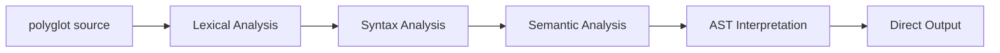

# polyglot Programming Language


A revolutionary programming language that supports symbolic syntax and Chinese programming, featuring intelligent memory management and zero garbage collector design. **The first Chinese programming language with Windows system-level file association support!**

## 🌟 Key Features

### 🌍 Dual Language Mode
- **polyglot** (English): Modern programming language using half-width symbols
- **Wenda (文达)** (Chinese): Localized programming experience with full-width symbols and Chinese identifiers

### 🔧 Core Features
- **Symbolic Syntax**: Intuitive symbols replace traditional keywords
- **Smart Memory Management**: Compile-time circular reference detection + smart pointers
- **Three-symbol Assignment System**: `=` strong reference, `~=` weak reference, `:=` value copy
- **External Configurable Symbols**: JSON configuration for dynamic symbol mapping
- **Zero Garbage Collection**: High-performance memory management with no runtime overhead

## 🚀 Quick Start

### System Requirements

**User Environment (Zero Dependencies):**
- UTF-8 encoded terminal support
- Windows/Linux/macOS operating system
- No compiler installation required!

**Developer Environment (Only needed for developing polyglot compiler itself):**
- C++17 compatible compiler (g++, clang++, MSVC)
- CMake 3.10+
- JSON configuration file support

### 🖱️ Windows One-Click Installation (Recommended)
```bash
# After downloading the project, right-click and run as administrator
一键安装文达编译器.bat
```
**After installation, double-click `.文达` or `.pg` files to compile directly!**

### 🔧 Manual Compilation and Installation
```bash
# Clone the project
git clone https://github.com/Fandel-Chuang/polyglot.git
cd polyglot

# Windows: Use Chinese build script
构建达文编译器.cmd

# Linux/macOS: Use build script
./build.sh

# Test installation
文达.bat ai_tests/测试/中文语法测试.文达
```

### 📋 Usage

#### Windows GUI (After file association installation)
```bash
# Double-click to compile - as simple as using Office
Double-click ai_tests/测试/中文语法测试.文达

# Right-click to compile - file manager context menu
Right-click file -> "Compile with Wenda Compiler"
```

#### Command Line Usage
```bash
# Chinese commands (recommended)
文达.bat your_program.文达
文达.bat your_program.pg

# English commands
./compiler/polyglot.exe your_program.pg
```

## 📚 Syntax Guide

### Basic Syntax Comparison

| Feature | English (polyglot) | Chinese (Wenda) |
|---------|-------------------|-----------------|
| Module Import | `>> "iostream"` | `》》 "输入输出流"` |
| Variable Declaration | `name := "Alice"` | `姓名 ：=  "爱丽丝"` |
| Struct Definition | `@ Player { ... }` | `@ 玩家 { ... }` |
| Method Implementation | `& Player { ... }` | `& 玩家 { ... }` |
| Function Return | `<- value` | `《- 值` |
| Loop Statement | `^(condition) { ... }` | `＾（条件）{ ... }` |

### Complete Examples

#### English Hello World
```rust
>> "iostream"

main() {
    print("Hello, polyglot!")
    <- 0
}
```

#### Chinese Hello World
```rust
》》 "输入输出流"

main() {
    print("Hello, Wenda!")
    <- 0
}
```

### Game Development Example

#### Player Class Definition (English)
```rust
>> "graphics"

@ Player {
    name: string,
    health: f64,
    position: Vector3
}

& Player {
    Player(name: string, initial_health: f64) {
        _.name = name
        _.health = initial_health
        _.position = Vector3{x: 0.0, y: 0.0, z: 0.0}
    }

    take_damage(damage: f64) {
        _.health -= damage
        (_.health <= 0.0) ? {
            print(_.name + " has died!")
        }
    }
}
```

## 🖥️ Windows System Integration

### File Association Installation

polyglot/Wenda is **the first Chinese programming language with Windows system-level file association support**, providing complete GUI integration experience.

#### 🚀 One-Click Installation (Recommended)
```bash
# Right-click and run as administrator
一键安装文达编译器.bat
```

#### 🔧 Step-by-Step Installation
```bash
# 1. Generate dynamic registry file
生成文达文件关联.bat

# 2. Install file association (requires administrator privileges)
安装文达文件关联.bat

# 3. Uninstall file association
卸载文达文件关联.bat
```

#### ✨ Post-Installation Features

**File Manager Integration**:
- `.文达` files display as "Wenda Source Code File"
- `.pg` files display as "Polyglot Source Code File"
- Double-click files to compile and display results directly

**Context Menu**:
- **Compile with Wenda Compiler** - Direct compilation of selected files
- **Edit** - Open files with Notepad

**Technical Features**:
- 🎯 **Dynamic Path Generation** - Supports installation in any location
- 🔄 **Smart Permission Management** - Automatic administrator privilege detection
- 🇨🇳 **Fully Localized** - All menus and prompts in Chinese
- 🚀 **Zero Configuration** - Ready to use after installation

## ⚙️🔧 Compiler Architecture

### AST Interpretation Execution Flow (v1.0.0 New Feature)

polyglot/Wenda compiler has been upgraded to **pure AST interpretation execution** architecture, running completely independently without any external compiler dependencies:



**New Architecture Features:**
- ✅ **Zero Dependencies** - No need to install g++, clang++, or other external compilers
- ✅ **Instant Execution** - Source code directly interpreted, no intermediate files
- ✅ **Self-Contained Architecture** - Single binary file completes all functions
- ✅ **Cross-Platform Support** - Unified experience on Windows/Linux/macOS

### Detailed Execution Phases

1. **Lexical Analysis** - Unicode and full-width symbol parsing, polyglot/Wenda syntax recognition
2. **Syntax Analysis** - Abstract Syntax Tree (AST) generation, dual-language mode support
3. **Semantic Analysis** - Type checking, variable declaration validation, circular reference detection
4. **AST Interpretation** - Direct AST node traversal and execution, built-in function library support
5. **Result Output** - Real-time program execution result display

### Traditional Compilation Process (Deprecated)
1. **Lexical Analysis** - Unicode and full-width symbol parsing support
2. **Syntax Analysis** - Abstract Syntax Tree (AST) generation
3. **Semantic Analysis** - Type checking and circular reference detection
4. **Code Generation** - Optimized C++ code output
5. **Local Compilation** - High-performance executable generation

### Architecture Comparison

| Feature | Traditional Compiler Mode | AST Interpreter Mode (Current) |
|---------|---------------------------|-------------------------------|
| External Dependencies | ❌ Requires g++/clang++ | ✅ Completely Independent |
| Execution Speed | 🚀 Fast after compilation | ⚡ Instant execution |
| Deployment Convenience | ❌ Requires compiler environment | ✅ Single file deployment |
| Debug Friendliness | ❌ Requires debugger | ✅ Direct AST-level debugging |
| Intermediate Files | ❌ Generates temporary C++ code | ✅ No intermediate files |

### Project Structure
```
polyglot/
├── compiler/              # Compiler core
│   ├── lexer.cpp         # Lexical analyzer
│   ├── parser.cpp        # Syntax analyzer
│   ├── semantic.cpp      # Semantic analyzer
│   ├── codegen.cpp       # Code generator
│   ├── symbol_config.cpp # Symbol configuration management
│   └── main.cpp          # Compiler entry point
├── symbol_mapping.json   # Symbol mapping configuration
├── examples/             # Example code
├── tests/               # Test cases
└── docs/                # Documentation
```

## ⚙️ Symbol Configuration System

polyglot supports custom symbol mapping through JSON configuration files without recompilation:

### symbol_mapping.json Example
```json
{
  "full_width_symbols": {
    "（": "LEFT_PAREN",
    "）": "RIGHT_PAREN",
    "{": "LEFT_BRACE",
    "}": "RIGHT_BRACE",
    "？": "QUESTION",
    "@": "STRUCT_DEF"
  },
  "chinese_keywords": {
    "整数": "TYPE_I32",
    "字符串": "TYPE_STRING",
    "真": "TRUE",
    "假": "FALSE"
  }
}
```

### Adding New Symbols
1. Edit `symbol_mapping.json`
2. Add symbols to appropriate category
3. Re-run compiler (no recompilation needed)

## 🎮 Game Development Support

polyglot is particularly suitable for game development, providing:

- **Component Architecture**: Interface and struct composition design
- **High-Performance Memory Management**: Zero GC, suitable for real-time rendering
- **Intuitive Syntax**: Symbolic syntax improves development efficiency
- **Chinese Programming**: Lowers language barriers for Chinese developers

## 💾 Memory Management

### Three-Symbol Assignment System
```rust
// Strong reference (default)
player1 := Player("Alice", 100.0)
player2 := player1  // Reference count +1

// Weak reference (avoid circular references)
? enemy ~= player1   // Does not affect lifecycle

// Value copy (deep copy)
? backup := player1  // Create complete copy
```

### Automatic Circular Reference Detection
The compiler detects and reports potential circular reference issues at compile time:
```
❌ Compilation Error: Circular reference detected
Player -> Enemy -> Weapon -> Player
Suggestion: Use weak reference (~=) to break the cycle
```

## 🔬 Testing and Examples

### Running Examples
```bash
# English examples
./polyglot examples/game_demo.pg

# Chinese examples
./polyglot examples/游戏演示.文达

# Performance tests
./polyglot tests/performance_test.pg
```

### Test Coverage
- ✅ Lexical analysis tests (Unicode + ASCII)
- ✅ Syntax analysis tests (dual-language mode)
- ✅ Semantic analysis tests (type checking)
- ✅ Memory management tests (circular reference detection)
- ✅ Code generation tests (C++ output validation)

## 🐛 Troubleshooting

### Common Issues

**Q: Unicode character errors during compilation?**
A: Ensure terminal supports UTF-8 encoding and check if the symbol is defined in `symbol_mapping.json`

**Q: How to add custom symbols?**
A: Edit `symbol_mapping.json`, add new symbol mappings, no recompilation needed

**Q: Circular reference detection too strict?**
A: Use weak references `~=` or ID references to break cycles, refer to best practices in documentation

**Q: Performance of generated C++ code?**
A: polyglot generates highly optimized C++ code with performance close to hand-written C++

## 🤝 Contributing

Contributions are welcome! Please follow these steps:

1. Fork the project repository
2. Create feature branch: `git checkout -b feature/amazing-feature`
3. Commit changes: `git commit -m 'Add amazing feature'`
4. Push branch: `git push origin feature/amazing-feature`
5. Create Pull Request

### Development Environment Setup
```bash
# Install dependencies
sudo apt-get install g++ cmake

# Run tests
make test

# Code formatting
clang-format -i compiler/*.cpp compiler/*.h
```

## 📜 License

This project is licensed under the MIT License - see [LICENSE](LICENSE) file for details

## 📁 Project Files Description

### 🚀 Build and Installation Scripts
| File Name | Function | Platform |
|-----------|----------|----------|
| `一键安装文达编译器.bat` | Fully automated installation (build + file association) | Windows |
| `构建达文编译器.cmd` | Chinese build script | Windows |
| `文达.bat` | Chinese compiler command | Windows |
| `build.bat` | English build script | Windows |
| `build.sh` | Unix build script | Linux/macOS |

### 🖱️ Windows File Association System
| File Name | Function |
|-----------|----------|
| `生成文达文件关联.bat` | Dynamically generate registry file |
| `安装文达文件关联.bat` | Install file association |
| `卸载文达文件关联.bat` | Remove file association |
| `Windows文件关联安装指南.md` | Detailed installation guide |

### 📚 Tests and Examples
| Directory | Content |
|-----------|---------|
| `ai_tests/basic_syntax/` | Basic syntax tests |
| `ai_tests/examples/` | Programming examples |
| `ai_tests/测试/` | Chinese test files |
| `ai_tests/semantic_tests/` | Semantic analysis tests |

## 🔗 Related Links

- [Windows File Association Installation Guide](Windows文件关联安装指南.md)
- [Syntax Reference](SYNTAX_UPDATE_v1.0.0.md)
- [Project Progress](PROGRESS.md)
- [Quick Start Guide](QUICKSTART.md)

## 👥 Contributors

Thanks to all developers who contributed to polyglot/Wenda!

## 📊 Project Status

- 🟢 Lexical Analyzer: Complete
- 🟢 Syntax Analyzer: Complete
- 🟢 Semantic Analyzer: Complete
- 🟢 Code Generator: Complete
- 🟢 Symbol Configuration System: Complete
- 🟡 Standard Library: In Development
- 🟡 IDE Plugin: Planned
- 🔵 Package Manager: Integrated

---

**polyglot/Wenda** - Make programming more intuitive, make creativity borderless 🌍✨
